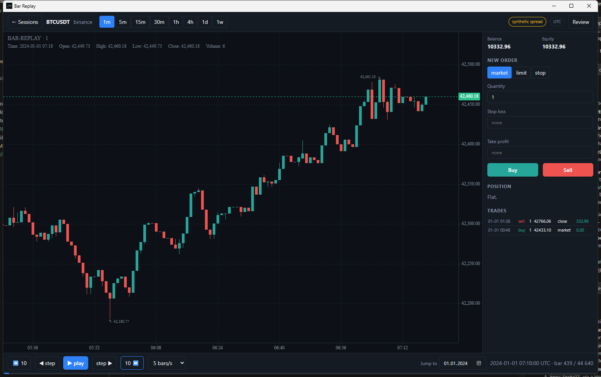
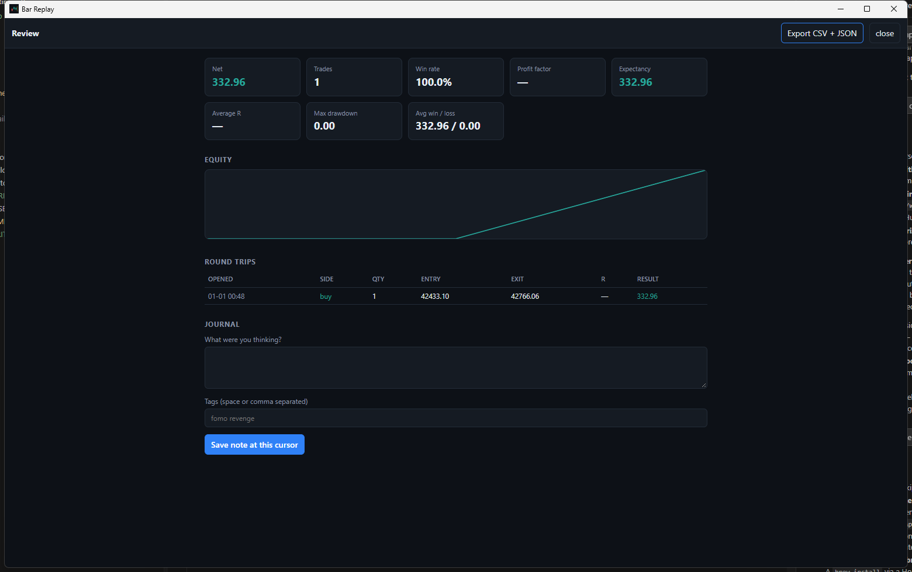

<div align="center">

# Bar Replay

**Replay the market candle by candle and trade it without knowing what comes next.**

[](https://github.com/TimFarmr/bar-replay/actions/workflows/ci.yml)
[](LICENSE)
[](docs/invariants.md#data-policy)
[](#install)



</div>

Pick an instrument and a date. The chart plays forward one candle at a time and
you place simulated trades seeing exactly what you would have seen at the time —
no more. It is a practice ground for discretionary traders.

**No account. No API key. No server.** Market data goes straight from the
provider to your machine. Nothing this project operates ever touches it.

Free and open source under the AGPL-3.0. There is no paid tier and never will be.

---

## Install

> **Pre-release.** Everything below works and is covered by 121 tests running on
> Windows and Linux, but this has not been through real-world use yet. Treat the
> numbers as a practice tool, not as evidence for risking money.

Grab the installer for your system from the [latest release](https://github.com/TimFarmr/bar-replay/releases/latest),
or [build it yourself](#building-from-source).

Installers are **unsigned** — the project has no code-signing certificate — so
the first launch shows a warning:

| | What you will see | What to click |
|---|---|---|
| **Windows** | "Windows protected your PC" | **More info** → **Run anyway** |
| **macOS** | "cannot be opened because the developer cannot be verified" | System Settings → Privacy & Security → **Open Anyway** |
| **Linux** | nothing | — |

## Your first replay, in about two minutes

1. **Open the app.** The form is already filled in with Bitcoin and a recent month.
2. **Press "Download this range."** Crypto arrives in about five seconds.
3. **Press "Start replay."**
4. **Press play**, or tap <kbd>→</kbd> to step one candle at a time.
5. **Buy** or **Sell** when you see something you like.

That is the whole product. Everything below is detail for later.

### Controls

| Control | |
|---|---|
| <kbd>Space</kbd> | play / pause |
| <kbd>→</kbd> <kbd>←</kbd> | one candle forward / back |
| <kbd>Shift</kbd> + <kbd>→</kbd> <kbd>←</kbd> | ten candles |
| **1m … 1w** | change timeframe; your place in the replay does not move |
| **Jump to** | skip to a date |
| **Review** | stats, equity curve, journal, export |

**Stepping backwards really undoes things.** Step back past the moment a trade
filled and that trade is gone — not hidden, gone. Step forward and it fills
exactly as it did before. Your position can never be a leftover from a future
that has been rewound.

---

## It tells you when it is guessing

A backtester that quietly flatters you is worse than none at all, because it
manufactures confidence you have not earned. Three places where this one refuses
to:

**⚠ assumed trades.** When one candle touches both your stop loss *and* your take
profit, there is genuinely no way to know from OHLC which came first. This app
assumes **the stop hit first** — the pessimistic answer — flags the trade, and
counts it on the Review screen. It will not pretend to know.

**Real vs synthetic spread.** The badge in the top right always states which you
are getting. A spread you typed in is your assumption, not history, and the app
says so rather than letting a number look like a fact.

**Gaps stay gaps.** Missing data is never interpolated or forward-filled to make
a chart look tidy. A closed market and a hole in the provider's data are drawn
differently, because reading price action across a data hole is a mistake.

The full contract is in **[docs/invariants.md](docs/invariants.md)** — worth
reading if you intend to trust the output.

---

## Where the data comes from

| Provider | Covers | Key needed? | Speed |
|---|---|---|---|
| **Binance** | Crypto, full minute history | No | ~5s per month |
| **Dukascopy** | Currencies and gold | No | slow; start with a week |
| **CSV** | Your own file | No | instant |
| **Databento** | CME futures, equities | Yes — your own | untested, see below |

Both free providers work on first launch with nothing configured.

**Your API key is yours.** It lives in your OS keychain — Windows Credential
Manager, macOS Keychain, Linux secret service. Never in a config file, never in
a log, never sent anywhere but that provider's own API.

Downloaded candles are cached so you never fetch twice, and nothing is deleted
automatically. Each session also keeps its own copy of the candles it started
with, so a provider quietly revising history later cannot change trades you
already took.

---

## Sessions

Close the app whenever you like, including with a position open. It is never
force-closed — the position is saved exactly as it stood and resumes at the same
candle.

Sessions are stored as a log of what you did, which is also why replaying one
always produces the same trade log.



**Review → Export** writes `trades.csv`, `round-trips.csv`, `journal.csv` and
`session.json` next to the session. Local files. Nothing is uploaded.

Note what the review screen refuses to invent: profit factor shows **—**
rather than infinity when nothing has been lost yet, and average R shows **—**
when a trade was taken without a stop, because R is undefined without one.

---

## Known limitations

Stated plainly, because a trading tool that hides its gaps is the problem it
claims to solve:

- **Tick-derived spread is not wired up.** Dukascopy publishes real bid/ask, but
  the app still charges the spread you typed. The badge tells you the data
  supports better, not that you are getting it.
- **The Databento adapter has never run against the live API.** It needs a paid
  key. Its symbol handling is very likely wrong as shipped.
- **Holiday detection is a heuristic**, not a real calendar, so an unusual
  outage can be mislabelled as a holiday.
- **Installers are unsigned** (see [Install](#install)).
- **The UI has no automated tests.** The Rust core has 121.

---

## What this deliberately is not

No automated strategies or optimisers. No live broker connections. No accounts,
no cloud sync, no sharing. No AI features. No server component of any kind.

Where more features and less friction were in conflict, friction won.

---

## Building from source

Needs [Rust](https://rustup.rs) and [Node 20+](https://nodejs.org).

```sh
git clone https://github.com/TimFarmr/bar-replay
cd bar-replay/ui && npm install && cd ..

# Build an installer for your platform (output in target/release/bundle/)
cd crates/app && ../../ui/node_modules/.bin/tauri build
```

For development, run `npm run dev` in `ui/`, then `cargo run -p bar-replay-app`
in another terminal.

> Use `tauri build`, not `cargo build --release`, for anything you intend to
> run standalone. A plain cargo build leaves the app pointing at the dev server
> instead of embedding the front end.

There is also a CLI for inspecting the data cache without the UI:

```sh
cargo run -p replay-cli -- instruments
cargo run -p replay-cli -- fetch binance BTCUSDT --from 2024-01-01 --to 2024-02-01
cargo run -p replay-cli -- candles binance BTCUSDT --tf 1h
```

Tests: `cargo test --workspace`. The no-lookahead property test takes about two
minutes on its own — it runs eight thousand queries.

## Contributing

[CONTRIBUTING.md](CONTRIBUTING.md) covers the layout and house rules. Read
[docs/invariants.md](docs/invariants.md) first; several decisions in
[docs/adr](docs/adr) are deliberate and load-bearing.

## License

AGPL-3.0-only. See [LICENSE](LICENSE).

Chosen to prevent a closed-source hosted fork. Market data must never be routed
through infrastructure this project operates — that constraint is legal, not
stylistic.
